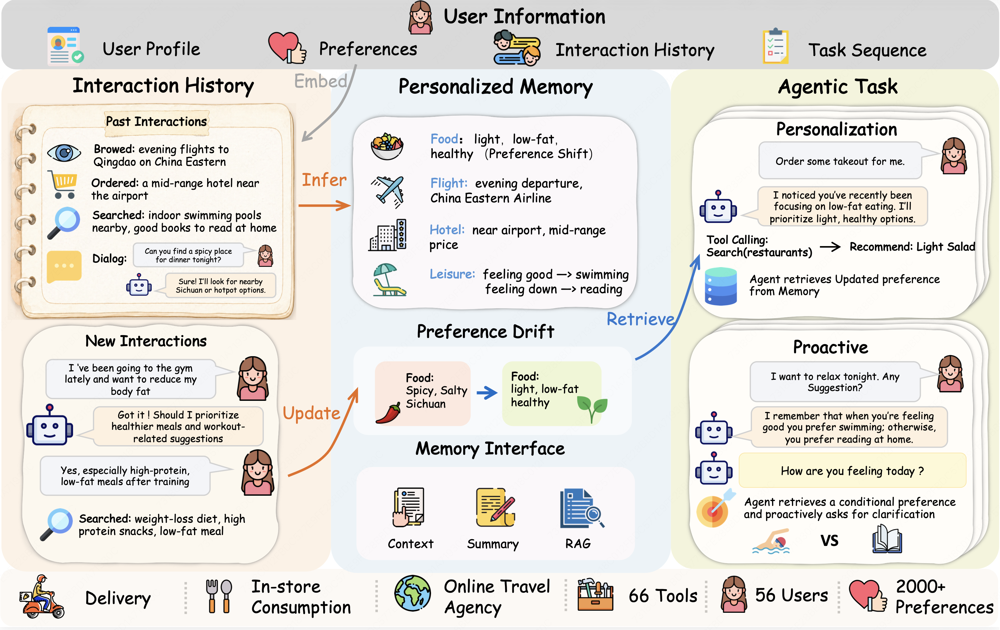

<div align=center><h1>
    🌱VitaBench 2.0: Evaluating Personalized and Proactive<br>
    Agents in Long-Term User Interactions
</h1></div>

<p align="center">
  📃 <a href="https://arxiv.org/abs/2605.27141" target="_blank">Paper</a> • 🌐 <a href="https://vitabench2.github.io/" target="_blank">Website</a> • 🤗 <a href="https://huggingface.co/datasets/meituan-longcat/VitaBench-2.0" target="_blank">Dataset</a> • 🌱 <a href="https://github.com/meituan-longcat/vitabench" target="_blank">VitaBench 1.0</a><br>
</p>

<p align="center">
  <b>🌍 English version benchmark coming soon.</b>
</p>

## 🔔 News

- [2026-06] **VitaBench 2.0** is released — extending VitaBench from one-shot tasks to **long-term, multi-session user interactions**, with an extensible memory interface and a personalization leaderboard. 🚀
- [2026-01] VitaBench has been accepted to **[ICLR 2026](https://openreview.net/forum?id=rtcX9qOBaz)**! 🎉
- [2025-10] The original [VitaBench](https://github.com/meituan-longcat/vitabench) suite is released, including the **codebase, dataset and evaluation pipeline**.

## 📖 Introduction

Large language models (LLMs) have evolved into interactive agents that collaborate with users in real-world tasks. Effective collaboration increasingly depends on understanding the user *beyond what is explicitly stated*: user intent is often reflected in fragmented daily interactions and requires both **personalized modeling** and **proactive interaction**. We introduce **VitaBench 2.0**, a benchmark for evaluating personalized and proactive agent behavior in long-term user interactions.

**VitaBench 2.0** extends [VitaBench](https://github.com/meituan-longcat/vitabench) from one-shot tasks to **long-term, multi-session user interactions**, where an agent must *infer*, *utilize*, and *update* user preference across fragmented conversations and behaviors that span days, weeks, or months. While VitaBench 1.0 measures whether an agent can complete a single complex life-serving request, VitaBench 2.0 further asks: **can an agent understand the user from daily interactions, anticipate their evolving needs, and act on their behalf — over time?**

Concretely, each evaluation is a **single user with a sequence of subtasks** drawn from the three life-service domains of VitaBench (food **delivery**, in-store consumption, and online travel / **OTA**). Between subtasks the agent's memory module is updated from the prior interaction; at the start of each subtask the memory is injected into the system prompt. The benchmark's core question is: *which memory backend lets the agent answer personalized queries correctly?*

To support systematic analysis, we provide an **extensible memory interface** that enables controlled comparison across representative memory architectures:

- **Full Context** — the entire interaction history is appended to the prompt, an upper bound on what the model can possibly leverage.
- **Agentic / Rewrite Memory** — the agent maintains a single consolidated memory store, deciding what to write and read across subtasks.
- **RAG Memory** — past interactions are chunked, embedded, and retrieved on demand.

Our results show that even SOTA models reach only **~50% Avg@4** under Full Context and degrade further under realistic memory settings, indicating that long-horizon personalization and proactivity remain open challenges for current LLM agents.

<p align="center">
  
</p>

> *The name "Vita" derives from the Latin word for "Life", reflecting our focus on life-serving applications.*

## 🌱 Benchmark Details

VitaBench 2.0 reuses the three life-service environments of VitaBench and recomposes them into **per-user, multi-subtask sequences**. Each task is one user; each subtask carries an `instruction`, a canonical `personalized_preference_memory`, `historical_chat` / `historical_behavior`, a rubric, and an `environment` of target + distraction entities across one or more env keys (`stores` / `shops` / `hotels` / `trains` / `flights` / `attractions`).

| Personalization dataset |          |
| :---------------------- | :------: |
| Users (tasks)           |    56    |
| Subtasks (total)        |   771    |
| Subtasks per user (avg) |   ~14    |
| Domains covered         | delivery · instore · ota |

The execution loop, per task:

```
load personalization task (user + subtasks)
  → PersonalizationOrchestrator
      for each subtask i:
          memory.process_interaction(prior interaction)   # skipped for i = 0
          env_i  = get_cross_environment(subtask_i.domain)
          agent  = PersonalizationAgent(env_i, memory)     # memory injected into system prompt
          run agent ↔ PersonalizationUser loop  (max-steps, tool use)
          reward_i = evaluator(trajectory_i, rubric_i)
      aggregate → SimulationRun (per-subtask rewards + overall)
```

## 🛠️ Quick Start

### 1. Install

```bash
git clone https://github.com/meituan-longcat/VitaBench-2.0.git
cd VitaBench-2.0
pip install -e .
```

This installs the `vita` CLI.

### 2. Download the dataset

VitaBench 2.0 tasks are hosted on Hugging Face: [meituan-longcat/VitaBench-2.0](https://huggingface.co/datasets/meituan-longcat/VitaBench-2.0).

```bash
pip install -U "huggingface_hub[cli]"
huggingface-cli download meituan-longcat/VitaBench-2.0 \
  --repo-type dataset \
  --local-dir data/vita/domains/personalization
```

After downloading you should have `data/vita/domains/personalization/tasks.json` (56 users, 771 subtasks).

> The original VitaBench domains (`delivery`, `instore`, `ota`, cross-domain) are still supported — download them from the [VitaBench 1.0 dataset](https://huggingface.co/datasets/meituan-longcat/VitaBench) and place each under `data/vita/domains/<domain>/tasks.json`.

### 3. Configure the LLM

```bash
cp src/vita/models.yaml.example src/vita/models.yaml
export OPENAI_API_KEY=sk-...
```

`src/vita/models.yaml` supports any OpenAI-compatible endpoint — change `default.base_url` to point at Azure, vLLM, Together, llama.cpp, etc. The YAML supports `${VAR}` placeholders expanded from your shell at startup; an unset variable raises a clear error. To relocate the file, set `VITA_MODEL_CONFIG_PATH`:

```bash
export VITA_MODEL_CONFIG_PATH=/path/to/your/models.yaml
```

For RAG / embeddings, optionally override the embedding provider:

| Env var | Default | Purpose |
|---------|---------|---------|
| `VITA_EMBEDDING_URL` | `models.yaml default.base_url` | Embedding endpoint |
| `VITA_EMBEDDING_KEY` | `models.yaml default.api_key` | Embedding API key |
| `VITA_EMBEDDING_MODEL` | `text-embedding-3-large` | Embedding model name |
| `VITA_EMBEDDING_MAX_CONCURRENCY` | `64` | Per-event-loop semaphore size |

### 4. Run a personalization evaluation

```bash
vita run \
  --domain personalization \
  --memory-type rewrite \           # null | rewrite | rag | rag_cache | full_context | groundtruth
  --agent-llm gpt-4.1 \
  --user-llm gpt-4.1 \
  --evaluator-llm gpt-4.1 \
  --max-steps 50 \
  --max-concurrency 50 \
  --save-to mytest/rewrite.json \   # resolved under data/simulations/
  --log-level INFO
```

Subset the run with `--num-tasks N` or `--task-ids <user_id> …`. Results are written under `data/simulations/`.

### 5. Run all memory backends in parallel

`scripts/run_memory_benchmark.sh` launches one `vita run` per memory type concurrently, holding `--max-steps`, `--max-concurrency` and the agent/user/evaluator LLMs identical across runs (the only fair way to compare backends):

```bash
bash scripts/run_memory_benchmark.sh full_context rewrite
```

Logs and per-backend results land in `data/simulations/memory_benchmark_<timestamp>/`, with a reward summary table printed on completion.

### Memory backends

| `--memory-type` | Behaviour |
|-----------------|-----------|
| `null` | No memory (baseline lower bound) |
| `groundtruth` | Injects the canonical preference memory directly (oracle upper bound) |
| `full_context` | Appends every prior interaction, token-truncated from the head |
| `rewrite` | LLM rewrites a single consolidated memory string each update (*agentic*) |
| `rag` | Async vector retrieval (`text-embedding-3-large` by default) |
| `rag_cache` | Same retrieval as `rag`, but embeddings are precomputed (see `scripts/precompute_rag_cache.py`) |

Per-backend defaults (RAG `top_k` / `similarity_threshold` / `chunk_size`, Rewrite / FullContext `max_tokens`) live in `src/vita/memory.yaml`; constructor kwargs override the YAML. Plug in a custom backend with `--memory-class my_pkg.MyMemory` (takes precedence over `--memory-type`).

### Re-evaluate existing simulations

```bash
vita run \
  --re-evaluate-file <simulation file> \
  --evaluation-type <trajectory | trajectory_full_traj_rubric | trajectory_sliding_wo_rubric | trajectory_full_traj_wo_rubric> \
  --evaluator-llm gpt-4.1 \
  --save-to <new file>
```

### View results

```bash
vita view --file <simulation file>
```

### Other CLI knobs worth knowing

| Flag | Effect |
|------|--------|
| `--enable-think` | Enable agent thinking mode |
| `--enable-outcome-reward` | Personalization only: combine trajectory reward with action-level outcome reward via `min()` |
| `--num-trials N` | Repeat each task N times (for Avg@N / Pass@N / Pass^N) |
| `--language chinese\|english` | Prompt / task language (default `chinese`) |
| `--max-errors N` | Max consecutive tool errors before aborting a task |
| `--csv-output <path>` | Append per-task results to a CSV |

## 🏆 Leaderboard

Performance of non-thinking and thinking models under three memory settings, sorted by **Avg@4** under **Full Context**. Best results in each column are in **bold**.

<h3>Non-thinking Models</h3>

<table>
  <thead>
  <tr>
    <th rowspan="2" align="left" width="220"><div align="left">Model</div></th>
    <th colspan="3" width="270"><div align="center">Full Context</div></th>
    <th colspan="3" width="270"><div align="center">Agentic Memory</div></th>
    <th colspan="3" width="270"><div align="center">RAG Memory</div></th>
  </tr>
    <tr>
      <th align="center" width="90">Avg@4</th><th align="center" width="90">Pass@4</th><th align="center" width="90">Pass^4</th>
      <th align="center" width="90">Avg@4</th><th align="center" width="90">Pass@4</th><th align="center" width="90">Pass^4</th>
      <th align="center" width="90">Avg@4</th><th align="center" width="90">Pass@4</th><th align="center" width="90">Pass^4</th>
    </tr>
  </thead>
  <tbody>
    <tr><td>GPT-4o-mini</td><td align="center">0.067</td><td align="center">0.180</td><td align="center">0.006</td><td align="center">0.084</td><td align="center">0.229</td><td align="center">0.008</td><td align="center">0.094</td><td align="center">0.227</td><td align="center">0.011</td></tr>
    <tr><td>GPT-3.5-Turbo</td><td align="center">0.140</td><td align="center">0.314</td><td align="center">0.019</td><td align="center">0.231</td><td align="center">0.467</td><td align="center">0.056</td><td align="center">0.205</td><td align="center">0.409</td><td align="center">0.059</td></tr>
    <tr><td>LongCat-Flash-Chat</td><td align="center">0.298</td><td align="center">0.510</td><td align="center">0.123</td><td align="center">0.302</td><td align="center">0.537</td><td align="center">0.105</td><td align="center">0.290</td><td align="center">0.471</td><td align="center">0.136</td></tr>
    <tr><td>GLM-4.5</td><td align="center">0.307</td><td align="center">0.529</td><td align="center">0.127</td><td align="center">0.330</td><td align="center">0.569</td><td align="center">0.112</td><td align="center">0.316</td><td align="center">0.523</td><td align="center">0.152</td></tr>
    <tr><td>Doubao-Seed-1.6</td><td align="center">0.326</td><td align="center">0.512</td><td align="center">0.171</td><td align="center">0.340</td><td align="center">0.576</td><td align="center">0.129</td><td align="center">0.351</td><td align="center">0.543</td><td align="center">0.174</td></tr>
    <tr><td>GLM-4.6</td><td align="center">0.342</td><td align="center">0.612</td><td align="center">0.113</td><td align="center">0.336</td><td align="center">0.623</td><td align="center">0.084</td><td align="center">0.317</td><td align="center">0.555</td><td align="center">0.123</td></tr>
    <tr><td>Kimi-K2.6</td><td align="center">0.378</td><td align="center">0.632</td><td align="center">0.147</td><td align="center">0.397</td><td align="center"><strong>0.674</strong></td><td align="center">0.145</td><td align="center">0.383</td><td align="center">0.621</td><td align="center">0.163</td></tr>
    <tr><td>GLM-5.1</td><td align="center">0.420</td><td align="center"><strong>0.654</strong></td><td align="center">0.204</td><td align="center">0.423</td><td align="center">0.664</td><td align="center">0.182</td><td align="center">0.383</td><td align="center">0.585</td><td align="center">0.200</td></tr>
    <tr><td>Doubao-Seed-2.0-pro</td><td align="center">0.428</td><td align="center">0.649</td><td align="center">0.218</td><td align="center">0.426</td><td align="center">0.665</td><td align="center">0.198</td><td align="center">0.406</td><td align="center"><strong>0.625</strong></td><td align="center">0.208</td></tr>
    <tr><td><strong>DeepSeek-V4-Pro</strong></td><td align="center"><strong>0.456</strong></td><td align="center">0.652</td><td align="center"><strong>0.267</strong></td><td align="center"><strong>0.427</strong></td><td align="center">0.658</td><td align="center"><strong>0.207</strong></td><td align="center"><strong>0.424</strong></td><td align="center">0.618</td><td align="center"><strong>0.247</strong></td></tr>
  </tbody>
</table>

<h3>Thinking Models</h3>

<table>
  <thead>
  <tr>
    <th rowspan="2" align="left" width="220"><div align="left">Model</div></th>
    <th colspan="3" width="270"><div align="center">Full Context</div></th>
    <th colspan="3" width="270"><div align="center">Agentic Memory</div></th>
    <th colspan="3" width="270"><div align="center">RAG Memory</div></th>
  </tr>
    <tr>
      <th align="center" width="90">Avg@4</th><th align="center" width="90">Pass@4</th><th align="center" width="90">Pass^4</th>
      <th align="center" width="90">Avg@4</th><th align="center" width="90">Pass@4</th><th align="center" width="90">Pass^4</th>
      <th align="center" width="90">Avg@4</th><th align="center" width="90">Pass@4</th><th align="center" width="90">Pass^4</th>
    </tr>
  </thead>
  <tbody>
    <tr><td>o4-mini</td><td align="center">0.210</td><td align="center">0.433</td><td align="center">0.047</td><td align="center">0.270</td><td align="center">0.533</td><td align="center">0.073</td><td align="center">0.261</td><td align="center">0.452</td><td align="center">0.091</td></tr>
    <tr><td>Gemini-2.5-Flash</td><td align="center">0.282</td><td align="center">0.556</td><td align="center">0.063</td><td align="center">0.312</td><td align="center">0.567</td><td align="center">0.098</td><td align="center">0.309</td><td align="center">0.544</td><td align="center">0.107</td></tr>
    <tr><td>Qwen3-Max</td><td align="center">0.284</td><td align="center">0.499</td><td align="center">0.105</td><td align="center">0.324</td><td align="center">0.599</td><td align="center">0.091</td><td align="center">0.315</td><td align="center">0.519</td><td align="center">0.134</td></tr>
    <tr><td>Gemini-2.5-Pro</td><td align="center">0.331</td><td align="center">0.605</td><td align="center">0.109</td><td align="center">0.378</td><td align="center">0.638</td><td align="center">0.138</td><td align="center">0.320</td><td align="center">0.579</td><td align="center">0.109</td></tr>
    <tr><td>MiniMax-M2.7</td><td align="center">0.349</td><td align="center">0.585</td><td align="center">0.136</td><td align="center">0.376</td><td align="center">0.629</td><td align="center">0.150</td><td align="center">0.335</td><td align="center">0.534</td><td align="center">0.148</td></tr>
    <tr><td>GLM-4.6</td><td align="center">0.359</td><td align="center">0.612</td><td align="center">0.116</td><td align="center">0.351</td><td align="center">0.625</td><td align="center">0.107</td><td align="center">0.336</td><td align="center">0.574</td><td align="center">0.135</td></tr>
    <tr><td>GLM-4.5</td><td align="center">0.369</td><td align="center">0.620</td><td align="center">0.157</td><td align="center">0.330</td><td align="center">0.581</td><td align="center">0.114</td><td align="center">0.343</td><td align="center">0.559</td><td align="center">0.160</td></tr>
    <tr><td>Doubao-Seed-1.6</td><td align="center">0.373</td><td align="center">0.599</td><td align="center">0.176</td><td align="center">0.383</td><td align="center">0.646</td><td align="center">0.123</td><td align="center">0.375</td><td align="center">0.591</td><td align="center">0.179</td></tr>
    <tr><td>DeepSeek-R1-0528</td><td align="center">0.396</td><td align="center"><strong>0.691</strong></td><td align="center">0.131</td><td align="center">0.412</td><td align="center"><strong>0.712</strong></td><td align="center">0.118</td><td align="center">0.390</td><td align="center"><strong>0.643</strong></td><td align="center">0.153</td></tr>
    <tr><td>o3</td><td align="center">0.403</td><td align="center">0.653</td><td align="center">0.169</td><td align="center">0.401</td><td align="center">0.669</td><td align="center">0.154</td><td align="center">0.362</td><td align="center">0.587</td><td align="center">0.158</td></tr>
    <tr><td>Claude-4.5-Sonnet</td><td align="center">0.417</td><td align="center">0.658</td><td align="center">0.197</td><td align="center">0.397</td><td align="center">0.642</td><td align="center">0.178</td><td align="center">0.374</td><td align="center">0.573</td><td align="center">0.186</td></tr>
    <tr><td>GPT-5</td><td align="center">0.441</td><td align="center">0.658</td><td align="center">0.226</td><td align="center">0.421</td><td align="center">0.647</td><td align="center">0.204</td><td align="center">0.410</td><td align="center">0.591</td><td align="center">0.236</td></tr>
    <tr><td>GLM-5.1</td><td align="center">0.450</td><td align="center">0.650</td><td align="center">0.270</td><td align="center">0.453</td><td align="center">0.680</td><td align="center">0.239</td><td align="center">0.383</td><td align="center">0.540</td><td align="center">0.226</td></tr>
    <tr><td>DeepSeek-V4-Pro</td><td align="center">0.472</td><td align="center">0.649</td><td align="center">0.295</td><td align="center">0.449</td><td align="center">0.656</td><td align="center">0.255</td><td align="center">0.430</td><td align="center">0.584</td><td align="center">0.271</td></tr>
    <tr><td>Doubao-Seed-2.0-pro</td><td align="center">0.474</td><td align="center">0.683</td><td align="center">0.270</td><td align="center">0.428</td><td align="center">0.650</td><td align="center">0.225</td><td align="center">0.339</td><td align="center">0.496</td><td align="center">0.205</td></tr>
    <tr><td>Kimi-K2.6</td><td align="center">0.481</td><td align="center">0.685</td><td align="center">0.266</td><td align="center">0.450</td><td align="center">0.696</td><td align="center">0.223</td><td align="center"><strong>0.434</strong></td><td align="center">0.611</td><td align="center">0.253</td></tr>
    <tr><td><strong>Claude-Opus-4.6</strong></td><td align="center"><strong>0.503</strong></td><td align="center">0.664</td><td align="center"><strong>0.337</strong></td><td align="center"><strong>0.454</strong></td><td align="center">0.645</td><td align="center"><strong>0.259</strong></td><td align="center">0.430</td><td align="center">0.566</td><td align="center"><strong>0.299</strong></td></tr>
  </tbody>
</table>

> **Avg@4** — mean success rate over 4 independent rollouts per task (single-attempt success).
> **Pass@4** — fraction of tasks solved in *at least one* of 4 rollouts (best-of-4).
> **Pass^4** — fraction of tasks solved in *all* 4 rollouts (consistency).

## 🔎 Citation

If you use VitaBench 2.0 in your research, please cite:

```bibtex
@article{chen2026vitabench,
  title={VitaBench 2.0: Evaluating Personalized and Proactive Agents in Long-Term User Interactions},
  author={Chen, Yuxin and Zhang, Yi and Cai, Zhengzhou and Shi, Yaorui and Yao, Zhiyuan and Cui, Chenhang and Zheng, Jingnan and Huo, Yaqi and Su, Xi and Gu, Qi and others},
  journal={arXiv preprint arXiv:2605.27141},
  year={2026}
}
```

And the original VitaBench paper this work builds on:

```bibtex
@article{he2025vitabench,
  title={VitaBench: Benchmarking LLM Agents with Versatile Interactive Tasks in Real-world Applications},
  author={He, Wei and Sun, Yueqing and Hao, Hongyan and Hao, Xueyuan and Xia, Zhikang and Gu, Qi and Han, Chengcheng and Zhao, Dengchang and Su, Hui and Zhang, Kefeng and Gao, Man and Su, Xi and Cai, Xiaodong and Cai, Xunliang and Yang, Yu and Zhao, Yunke},
  journal={arXiv preprint arXiv:2509.26490},
  year={2025}
}
```

## 🤗 Acknowledgement

VitaBench 2.0 is built on top of [VitaBench](https://github.com/meituan-longcat/vitabench), which itself adapted part of [tau2-bench](https://github.com/sierra-research/tau2-bench)'s codebase. We greatly appreciate their contributions to the agent community.

## 📜 License

This project is licensed under the MIT License — see the [LICENSE](./LICENSE) file for details.

## 📪 Support

For questions and support, please open an issue on GitHub or contact the maintainers.
